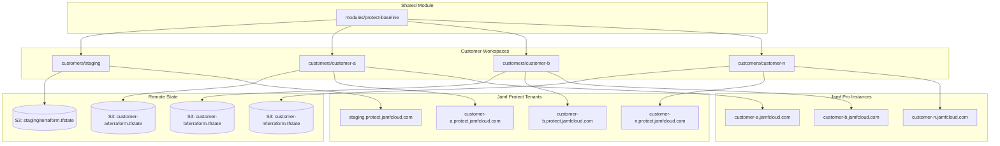
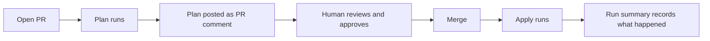

# terraform-jamf-platform — `ref-jamfprotect-msp` reference layout

> **You are on the `ref-jamfprotect-msp` branch.** This is an orphaned
> reference branch containing a multi-tenant Terraform pipeline for Jamf
> Protect, aimed at managed service providers and anyone running more than
> one Jamf tenant. Other branches in this repository are unrelated and
> follow different layouts. If you are looking for a single-tenant Jamf Pro
> starting point, see the `ref-jamfpro` branch instead.

A sanitised reference version of a production system. It manages Jamf Protect
across a fleet of customer tenants from one repository: one shared module, one
directory per tenant, one state file each, and a CI/CD pipeline that plans on
every pull request and applies on merge.

This is the repository behind the JNUC 2026 session *Managing the Jamf
Platform at Scale With IaC*. What you have here is the same architecture with
the organisation-specific parts removed — no customer data, no internal
tooling, no chat webhooks, no real credentials or state buckets.

Built on the
[Jamf-Concepts/jamfprotect](https://registry.terraform.io/providers/Jamf-Concepts/jamfprotect/latest)
and
[deploymenttheory/jamfpro](https://registry.terraform.io/providers/deploymenttheory/jamfpro/latest)
providers.

---

## What this is, and is not

**It is** a worked example of running Jamf configuration as code across many
tenants, including the parts people usually have to work out for themselves:
state isolation, credential scoping, promotion between environments, drift
detection, and catching resources that were created outside Terraform
entirely.

**It is not** a module published for direct consumption, and not a turnkey
product. Fork it, read it, take the patterns you need, and change the rest.
Several things in here are deliberate trade-offs that suited one service and
may not suit yours — those are called out in comments where they occur rather
than smoothed over.

Jamf publishes and maintains these providers. We do not deliver Infrastructure
as Code transformation as a commercial service, and we do not provide guidance
on architecting CI/CD or remote state beyond what is documented here. This
repository is a reference and a learning resource; it is not a deliverable.

**The patterns are not Jamf Protect patterns.** Module reuse, state isolation,
credential scoping, CI/CD, Git as the source of truth — none of that is
product-specific. Swap the resources inside the module for Jamf Pro resources
and the architecture is unchanged. Protect is simply what this particular
pipeline manages.

---

## What this covers

- **Jamf Protect** — plans, analytics and analytic sets, action configurations,
  exception sets, removable storage device controls, telemetry, SIEM data
  forwarding, roles, API clients, console users
- **Jamf Pro** — Jamf Protect registration, in the same apply, so one pipeline
  reaches two products
- **Multi-tenancy** — per-tenant state, per-tenant credentials, a shared
  baseline, and per-tenant overrides
- **Operations** — onboarding, offboarding, console handover, drift detection
  and remediation, out-of-band resource detection, stale state lock recovery

---

## Before you start

Nine files reference something you must change. None of them will work as
shipped, deliberately — a placeholder that looks plausible is worse than one
that fails.

| What | Where | Why |
|---|---|---|
| State bucket and region | `customers/_template/terraform.tf` | Backend blocks cannot use variables, so this is a literal edit. Ships as `replace-me-jamfprotect-tfstate` so a first `init` fails rather than pointing somewhere real. |
| `STATE_BUCKET` repository variable | GitHub repository settings | Used by the destroy and handover workflows to remove state objects. Must match the bucket above. |
| `AWS_REGION` repository variable | GitHub repository settings | Region of that bucket. |
| AWS credentials | Repository secrets | See [State backend](#state-backend) — prefer OIDC over static keys if you can. |
| Console user lists | `modules/protect-baseline/variables.tf` | `full_admin_users` and `read_only_users` default to empty. Populate with your own team. |
| Global exclusions | `modules/protect-baseline/exception_sets.tf` | Ships with one worked example. Replace it with exclusions you have actually evidenced. |
| Bootstrap API client name | `BOOTSTRAP_API_CLIENT_NAME` repository variable | The hand-made client Terraform authenticates with. Out-of-band detection excludes it by name, so this must match what you called yours. |
| Example customer | `customers/example-customer/` | Delete it. It exists to be read, not applied. |
| Notification steps | `.github/workflows/*.yaml` | There are none. See [Notifications](#notifications). |

---

## Architecture



One module, many thin workspaces. Change the module once and every tenant
picks it up on its next apply — nobody logs into fifty consoles to make the
same change fifty times.

---

## Repository structure

```
terraform-jamf-platform/
├── modules/
│   └── protect-baseline/            # The shared baseline. Every customer calls this.
│       ├── main.tf                  # Providers, version constraints, feature flags
│       ├── variables.tf             # The menu: everything a customer may vary
│       ├── plans.tf                 # Protect plans (one or two, depending on tier)
│       ├── analytics.tf             # Custom analytic + analytic set
│       ├── action_configuration.tf  # Alert collection
│       ├── device_controls.tf       # Removable storage — enhanced tier only
│       ├── telemetry.tf             # Endpoint telemetry — opt-in
│       ├── data_forwarding.tf       # SIEM forwarding — opt-in
│       ├── exception_sets.tf        # Global + per-customer exclusions
│       ├── role.tf                  # Built-in role lookup + reporting role
│       ├── api_client.tf            # API clients Terraform issues
│       ├── jamf_pro.tf              # Protect registration inside Jamf Pro
│       ├── users.tf                 # Console access
│       └── outputs.tf
├── customers/                       # One directory per tenant
│   ├── _template/                   # Scaffold the onboarding script copies
│   │   ├── main.tf                  # Calls the module
│   │   ├── terraform.tf             # Backend — customer name in the state key
│   │   ├── customer.auto.tfvars     # Tier and overrides
│   │   └── outputs.tf
│   ├── staging/                     # Shared validation workspace
│   └── example-customer/            # Worked example — read it, then delete it
├── .github/workflows/               # The pipeline
│   ├── plan.yaml                    # Plan on pull request, comment on the PR
│   ├── apply.yaml                   # Apply on merge
│   ├── destroy.yaml                 # Manual: empty a tenant
│   ├── handover.yaml                # Manual: remove state, keep the console
│   ├── force-unlock.yaml            # Manual: clear a stale state lock
│   ├── drift.yaml                   # Weekly: has anything changed under us?
│   ├── remediate.yaml               # Label-triggered: put it back
│   └── reconcile.yaml               # Weekly: what exists that we never created?
└── scripts/                         # The automation around the edges
    ├── onboard-customer.sh
    ├── offboard-customer.sh
    ├── enable-data-forwarding.sh
    ├── reconcile-out-of-band.sh
    ├── fetch-audit-logs.sh
    ├── build-out-of-band-report.sh
    ├── audit-op-map.json
    └── reconcile.tfquery.hcl
```

Customers are thin. A customer directory is a module call, a backend, and a
tfvars file — the entire tenant. All the substance lives in the shared module,
and all the operational work lives in the pipeline and the scripts.

### Why this split

- **One canonical definition of "good".** Every plan, analytic and exception
  set lives in `modules/protect-baseline/`. There is no copy per tenant, so a
  fix is written once and inherited everywhere.
- **One directory per tenant, holding only what is genuinely tenant-specific.**
  Which tenant to talk to, which credentials, where state lives, and which
  options that customer has ordered.
- **Two ways to handle differences.** Something several customers might want
  becomes a module variable set per tenant in tfvars. Something exactly one
  customer needs can be declared directly in their `main.tf` next to the module
  call — but do that sparingly, because it is a snowflake nobody reviewing the
  module will know about.

### Design the menu before you design the folders

This is the part that matters most and the part no directory structure will
save you from getting wrong.

Decide what every customer gets and what they are allowed to choose. In this
reference:

| | On the menu |
|---|---|
| **Bases** | `standard` — threat prevention. `enhanced` — threat prevention plus removable storage device controls. |
| **Options** | USB device exceptions, threat prevention exception sets, SIEM data forwarding, telemetry. |

That is everything a customer can vary, and it maps one-to-one onto the
variables in `modules/protect-baseline/variables.tf`. If it is not there, it
cannot be ordered — the module does not know how to make it.

When a customer asks for something new, it goes on the menu: add the variable,
apply it through review, and now anyone can order it and it is built the same
way every time. What you must not do is quietly configure it in their console
afterwards. That is the drift you built this pipeline to catch.

---

## State and isolation

Two mechanisms keep tenants apart, and both are one line of configuration.

**Separate state.** From `customers/<name>/terraform.tf`:

```hcl
backend "s3" {
  bucket       = "your-tfstate-bucket"
  key          = "customers/<CUSTOMER_NAME>/terraform.tfstate"
  region       = "your-region"
  encrypt      = true
  use_lockfile = true
}
```

The customer name is in the key, so every tenant reads and writes a completely
separate object. `use_lockfile = true` is native S3 locking — two operations
against the same customer cannot run concurrently, so the second is blocked
rather than corrupting state.

**Separate credentials.** From every workflow that touches a tenant:

```yaml
environment:
  name: ${{ matrix.customer }}
```

That scopes secrets to a GitHub Environment named after the customer. When the
pipeline runs for customer A, customer B's secrets are not merely unused —
they are not present in the runner at all.

Together: separate state, separate credentials, per tenant. A bad apply reaches
nobody else.

**This matters at any scale.** Even with one environment, remote state means a
dead laptop does not take your state with it, and locking means two engineers
cannot apply over each other.

---

## Prerequisites

| Tool | Minimum | Purpose |
|---|---|---|
| [Terraform](https://developer.hashicorp.com/terraform/install) | `>= 1.14.0` | 1.14 introduced `terraform query`, which out-of-band detection depends on. Plan and apply alone work on 1.11+. |
| [GitHub CLI](https://cli.github.com) (`gh`) | Latest | Environment and secret management, pull request automation |
| [jamf-cli](https://github.com/jamf-concepts/jamf-cli) | Latest | Jamf Pro API role and OAuth2 client creation during onboarding; Protect audit-log retrieval |
| AWS CLI | v2 | State bucket access. CI/CD handles this itself. |
| `jq` | Latest | Used throughout the scripts |

You also need:

- **A Jamf Protect tenant you own** to use as the `staging` workspace. Do not
  point staging at a customer tenant.
- **An API client created by hand in each customer's Protect console** before
  their first apply. Terraform cannot create the credential it needs to
  authenticate with in the first place. Once onboarded, the module manages its
  own clients from there.
- **A Jamf Pro admin account** for each customer's instance, used once during
  onboarding to bootstrap an OAuth2 client. It is never stored.

---

## Getting started

### 1. Clone

This work lives on the orphaned `ref-jamfprotect-msp` branch and will not move.
Use `--single-branch` so you only fetch what you need:

```bash
git clone --branch ref-jamfprotect-msp --single-branch \
  https://github.com/Jamf-Concepts/terraform-jamf-platform.git
cd terraform-jamf-platform
```

Then push it into your own repository. The pipeline needs GitHub Environments
and repository secrets, so it has to run somewhere you control.

### 2. Create the state bucket

An S3 bucket with versioning enabled. Versioning is what lets you recover from
a bad state write, and state is the one thing in this system you cannot
rebuild from the code.

Set `bucket` and `region` in `customers/_template/terraform.tf`, then set the
`STATE_BUCKET` and `AWS_REGION` repository variables to match.

### 3. Configure repository secrets and variables

**Repository level** — shared by every workflow:

| Name | Type | Purpose |
|---|---|---|
| `AWS_ACCESS_KEY_ID` | Secret | State bucket access |
| `AWS_SECRET_ACCESS_KEY` | Secret | State bucket access |
| `AWS_REGION` | Variable | State bucket region |
| `STATE_BUCKET` | Variable | State bucket name, for destroy and handover |
| `BOOTSTRAP_API_CLIENT_NAME` | Variable | Name of the hand-made Protect API client, excluded from out-of-band detection |
| `DRIFT_ISSUE_ASSIGNEES` | Variable | Optional. Comma-separated GitHub usernames to assign drift issues to. |
| `ADMIN_TEAM_ORG` / `ADMIN_TEAM_SLUG` | Variable | Optional. Gate drift remediation on membership of a GitHub team. |
| `ORG_READ_TOKEN` | Secret | Only needed with the above — a token with `read:org`. |
| `REPORT_MENTION` | Variable | Optional. An @mention added to out-of-band issues. |

**Environment level** — one GitHub Environment per customer, created by the
onboarding script:

| Name | Type | Purpose |
|---|---|---|
| `PROTECT_URL` | Variable | Tenant URL. Not sensitive, and useful in logs. |
| `PROTECT_CLIENT_ID` | Secret | Protect API client ID |
| `PROTECT_CLIENT_PASSWORD` | Secret | Protect API client password |
| `JPRO_URL` | Secret | Jamf Pro instance URL |
| `JPRO_CLIENT_ID` | Secret | Jamf Pro OAuth2 client ID |
| `JPRO_CLIENT_SECRET` | Secret | Jamf Pro OAuth2 client secret |
| `SENTINEL_APP_SECRET` | Secret | Only for customers with SIEM forwarding |

### 4. Set up branch protection

The pipeline's guarantees come from branch protection, not from the workflows.
Without it, someone can push straight to `main` and the review gate is
decorative.

On `main` and on `staging`:

- Require a pull request, no direct pushes
- Require at least one approving review
- Require the `plan-result` status check
- Do not allow a pull request author to approve their own

Require `plan-result` specifically, not the individual matrix jobs — their
names change as customers come and go.

### 5. Point staging at your own tenant

Onboard `staging` first, against a tenant you own:

```bash
./scripts/onboard-customer.sh staging standard
```

Merge it, confirm the apply builds what you expect in that console, and only
then onboard a real customer.

### 6. Delete the example

```bash
git rm -r customers/example-customer
```

---

## The pipeline

Every configuration change follows the same path. There is no manual
`terraform apply` and nothing to log into.



| Workflow | Trigger | What it does |
|---|---|---|
| `plan.yaml` | Pull request into `main` or `staging` | Detects affected customers, lints and validates, plans each one, posts the plan as a PR comment. Aggregates into a single `plan-result` check. |
| `apply.yaml` | Push to `main` or `staging` | Applies to each affected customer, in parallel, each scoped to its own Environment. |
| `drift.yaml` | Monday 06:00 UTC, or manual | Plans every customer with `-detailed-exitcode`. Opens or updates a GitHub issue per customer where drift is found. |
| `remediate.yaml` | `auto-remediate` label on a drift issue | Verifies the person is authorised, then re-applies to revert the drift. Closes the issue on success. |
| `reconcile.yaml` | Monday 07:00 UTC, or manual | Finds resources in a tenant that Terraform never created, attributes them via the audit log, opens an issue. |
| `destroy.yaml` | Manual | Destroys every managed resource in one tenant, then removes its state. Requires the customer name retyped to confirm. |
| `handover.yaml` | Manual, usually via the offboard script | Removes only the state object. Touches no Jamf resource. |
| `force-unlock.yaml` | Manual | Clears a stale state lock left by an interrupted run. |

**Which customers get planned or applied.** Changes under `customers/<name>/`
affect that customer only. Any change under `modules/` affects **every**
customer, so every workspace is planned and applied. This is intentional and it
is the case to be careful with: always read the plan output for every customer
before merging a module change. What is correct on one tier can behave
differently on another.

### Branching strategy

```
feature/my-change
      │
      │  PR into staging → plans against the staging workspace only
      │  → review → merge → applies to staging only
      ▼
  staging
      │
      │  PR from staging into main → plans against every affected customer
      │  → review → merge → applies to every affected customer
      ▼
  main → customer tenants
```

| Environment | Branch | State | Purpose |
|---|---|---|---|
| Dev | Local feature branch | None | Build and iterate freely against a sandbox tenant |
| Staging | `staging` | Remote, per workspace | Shared validation tenant, mirrors production, no console changes |
| Production | `main` | Remote, per customer | Every customer tenant |

Use staging for anything that changes the shared module, since that reaches
every tenant. A change that only enables an already-validated feature for one
customer via their tfvars can go straight from a feature branch into `main` —
the feature itself was proved through staging when it was built.

Branch naming that keeps the history readable:

| Change | Branch |
|---|---|
| New customer | `new-customer/example-corp` |
| Offboarding | `offboard/example-corp` |
| Enable data forwarding | `enable-data-forwarding-sentinel/example-corp` |
| Baseline module change | `update/baseline-plan-settings` |
| Workflow or docs | `fix/apply-fetch-depth` |

---

## Onboarding a customer

Two manual prerequisites: an API client created in the customer's Protect
console, and a Jamf Pro admin account for their instance. Then one command:

```bash
./scripts/onboard-customer.sh <customer-name> [standard|enhanced]
```

Two decisions — the name and the tier. The script:

1. Creates the GitHub Environment
2. Prompts for Protect credentials
3. Deletes the auto-created default plan and action configuration from the
   tenant via jamf-cli — they ship with every new tenant, and the default plan
   syncs an unscoped configuration profile into Jamf Pro if left in place
4. Prompts for Jamf Pro admin credentials and obtains a bearer token
5. Confirms Protect is not already registered in that Jamf Pro instance
6. Creates a least-privilege API role and OAuth2 client in Jamf Pro
7. Stores all six secrets in the Environment — only after every check passes
8. Scaffolds the customer directory from `_template`
9. Commits, pushes, and opens a pull request

The ordering is the point: nothing is written to GitHub until every validation
has passed, so a failure halfway through leaves nothing half-configured.

The plan runs automatically on the pull request. After review and merge, the
apply provisions the baseline and registers Protect in Jamf Pro.

## Offboarding a customer

Two paths, depending on whether the customer is keeping their console.

**The tenant is being emptied.** Run the Terraform Destroy workflow from the
Actions tab, then:

```bash
./scripts/offboard-customer.sh <customer-name>
```

This verifies the destroy succeeded, deletes the GitHub Environment and its
secrets, removes the customer directory and opens a pull request for the audit
trail. Afterwards, revoke the bootstrap API client in their console by hand —
Terraform did not create it, so destroy did not remove it.

**The customer keeps their console.** Do not run destroy:

```bash
./scripts/offboard-customer.sh --handover <customer-name>
```

In handover mode the script runs no destroy and touches no Jamf resource. It
dispatches `handover.yaml`, which deletes only that customer's state object —
confirming the object exists first, verifying it is gone afterwards, and
failing loudly if it was already missing rather than reporting a handover that
did not happen. The script waits for that run (pinned by run id, not "latest"),
reads the confirmed state key back out of the log, then does the same GitHub
cleanup.

Handover is dispatched against `main`, so it must be merged before the first
handover can run.

Console cleanup after a handover — removing your team's users and any
integration clients the customer does not need — is manual. Automating it is
straightforward and deliberately not done here, because what to leave behind
is a commercial decision, not a technical one.

---

## SIEM data forwarding

Opt-in per customer, available on all tiers. When enabled, alerts and telemetry
are forwarded to the configured destination.

| Destination | Status |
|---|---|
| Microsoft Sentinel | Implemented |
| Amazon S3 | Provider supports it; the module ships the block disabled |

An Azure App Registration, Data Collection Endpoint and Data Collection Rules
must exist in the customer's Azure tenant first. This pipeline wires Jamf
Protect to them; it does not create them.

```bash
./scripts/enable-data-forwarding.sh <customer-name> --sentinel
```

The script prompts for the Azure values, stores the application secret as
`SENTINEL_APP_SECRET` in the customer's Environment, writes the non-secret
values into their tfvars, and opens a pull request.

**On rotating the secret.** The application secret is a write-only argument:
Terraform sends it but never reads it back into state, so it has nothing to
compare against. Rotating it means updating the GitHub secret **and**
incrementing `app_secret_version` in the customer's tfvars. The version bump is
the only signal Terraform gets that anything changed.

---

## Drift detection and remediation

Drift is not malicious. Someone tweaks a setting to troubleshoot, or adds an
exception under pressure, and forgets. Every change made sense at the time;
nobody tracked the cumulative effect. The point of this pair of workflows is
that the system notices, rather than you finding out when something breaks.

**Detection** runs weekly and plans every customer with
`terraform plan -detailed-exitcode`. Exit 0 means reality matches the code;
exit 2 means it does not; exit 1 is a genuine error. On drift it opens or
updates one GitHub issue per customer with the full plan output.

`staging` is excluded — it is expected to be ahead of `main` during
development, so drift there is the normal state rather than a signal.

**Remediation is deliberately boring.** Because the repository is the source of
truth, fixing drift is just `terraform apply`. What makes it safe is not the
mechanism but the gate:

- It is triggered by a person applying the `auto-remediate` label. Nothing
  reverts on a schedule.
- It checks who that person is first. Labels are cheap to apply, and applying
  one must not be a route to a production apply without authorisation. With
  `ADMIN_TEAM_ORG`/`ADMIN_TEAM_SLUG` set it gates on team membership;
  otherwise it requires `admin` or `maintain` on the repository.

**Drift showing up is not automatically wrong.** It is a decision. Someone
looks at it and asks whether the change should exist. If it should, it goes
into the code through a reviewed pull request. If it should not, remediate. The
system surfaces the change and hands a human the call — it does not make the
call for you.

---

## Out-of-band resource detection

Drift detection has a blind spot, and it is a big one.

Terraform can only report on what it manages. A resource somebody created
directly in the console has no state entry, so it never appears in a plan and
never registers as drift. Terraform does not know it exists.

`reconcile.yaml` closes that gap using **list resources**, a Terraform 1.14
feature that queries existing infrastructure whether or not it is in state.
All the Jamf Concepts providers support it — it is also what powers
[jamformer](https://github.com/Jamf-Concepts/jamformer)'s ability to generate
HCL from an existing tenant.

The workflow, weekly and per customer:

1. `terraform query -json` — everything the provider can see in the tenant.
   The `list` blocks live in `scripts/reconcile.tfquery.hcl`, with
   `exclude_builtins = true` on every type that has built-ins so the
   Jamf-provided defaults do not show up as findings.
2. `terraform show -json` — everything Terraform manages.
3. Diff the two. Present in the tenant, absent from state, is out of band.
4. Attribute each finding: fetch the Protect audit log via jamf-cli to
   establish who created it and when.
5. Open or update a GitHub issue with a table of findings.

Each finding needs a decision — import it, or delete it — recorded on the
issue. At minimum, it is a reason to go and ask why the resource was created,
which is usually the more interesting question.

Two details worth knowing if you adapt this:

- **The bootstrap API client is excluded by name.** It exists in every tenant
  and is intentionally unmanaged, so without the exclusion it would be a
  permanent false positive on every customer, every week. Set
  `BOOTSTRAP_API_CLIENT_NAME` to whatever you named yours.
- **It fails loudly rather than reporting nothing.** If the query produces no
  list events at all, the script exits non-zero instead of writing an empty
  result. "Zero out-of-band resources" and "the query did not run" look
  identical in a report, and only one of them is good news.

---

## Notifications

**There are none, on purpose.** The production version of this pipeline posts
to Slack after every apply, destroy, drift finding and remediation. Those steps
have been removed, because a webhook URL, a channel and a message format are
the most organisation-specific thing in any pipeline, and a half-configured
notification step is worse than none.

What is here instead is the GitHub-native equivalent: every workflow writes a
run summary, and drift and reconcile findings become GitHub issues, which
notify whoever is watching the repository or assigned to them. For many teams
that is genuinely enough.

If you do want outbound notifications, each workflow has a marked
`# --- Notifications ---` block at the end of its job. The pattern is a single
step reading `job.status`, the customer, and the run URL:

```yaml
      - name: Notify
        if: always()
        env:
          WEBHOOK: ${{ secrets.YOUR_WEBHOOK_URL }}
        run: |
          curl -sS -X POST "$WEBHOOK" \
            -H 'Content-Type: application/json' \
            -d @- <<EOF
          {
            "text": "Apply ${{ job.status }} — ${{ matrix.customer }} (by ${{ github.actor }}): ${{ github.server_url }}/${{ github.repository }}/actions/runs/${{ github.run_id }}"
          }
          EOF
```

Two things worth getting right whatever you use. Notify on failure as well as
success — a pipeline that only tells you when it worked trains people to
ignore it. And do not put anything sensitive in the message; link to the run
instead.

---

## Terraform hygiene

**`-parallelism=1` everywhere, and it is not optional.** The Jamf Protect
GraphQL API rate limits concurrent requests and returns errors under parallel
load. Every Terraform invocation in this repository is single-threaded. If you
add one, do the same.

**`apply` and `destroy` only ever run in CI/CD.** Running them locally against
a customer tenant risks state divergence and changes nobody reviewed. Local
`terraform plan` is fine for development against a tenant you own; never point
it at a workspace the pipeline manages.

**State is a secret.** It holds credentials in plain text. `sensitive = true`
on an output keeps a value out of logs; it does nothing about state. Encrypt
the bucket, restrict access to it, and never edit or delete state by hand — the
destroy and handover workflows handle state cleanup for you.

**Provider versions are constrained with `>=`, and the lock file is
gitignored.** Run `terraform init -upgrade` to pick up the latest version that
satisfies the constraints. This trades bit-for-bit reproducibility for staying
current in a fast-moving provider ecosystem — a deliberate choice, and one you
may want to reverse. Committing `.terraform.lock.hcl` and pinning exact
versions is the more conservative position and is entirely reasonable.

| Provider | Source | Minimum |
|---|---|---|
| jamfprotect | `Jamf-Concepts/jamfprotect` | 0.10.0 |
| jamfpro | `deploymenttheory/jamfpro` | 0.41.0 |

**Providers are configured inside the module, not in each root.** This keeps
customer workspaces to three files, at the cost of a module that cannot be
called with `count`, `for_each` or an aliased provider. Terraform's own
guidance is to configure providers only in root modules. The trade-off is
explained in `modules/protect-baseline/main.tf`; if you need one workspace to
reach two tenants, move the provider blocks up into the customer root.

### State backend

S3 with native lockfile locking, because the pipeline needs remote state with
locking and this is the least-friction option that provides both. Alternatives,
with the caveat that each needs workflow changes:

- **HCP Terraform** is the lowest-friction remote option for teams without
  existing cloud infrastructure, and the free tier covers a fair amount. It
  changes the backend block, the credential handling and the destroy and
  handover state cleanup, since those currently use `aws s3 rm`.
- **GCS or Azure Storage** work equally well as backends; same caveat about the
  state cleanup steps.

**Prefer OIDC over static AWS keys.** The workflows use
`AWS_ACCESS_KEY_ID`/`AWS_SECRET_ACCESS_KEY` for portability, but long-lived
keys in GitHub secrets are the weakest link in this setup. If your state bucket
is in AWS, configure GitHub as an OIDC identity provider and have
`aws-actions/configure-aws-credentials` assume a role instead — it is a
per-workflow change and removes the standing credential entirely.

---

## Troubleshooting

**`Error acquiring the state lock`** — a previous run was interrupted and left
the lock object behind. Take the Lock ID from the failed run's log and dispatch
the Force Unlock workflow. Only do this when you are certain no apply is
actually in progress.

**`Error: 429 Too Many Requests`** — API rate limiting. Confirm
`-parallelism=1` is set on the invocation. If it is, re-run; the providers
retry internally but occasionally surface the error.

**`terraform plan` shows changes nobody made** — that is drift, and it is
working. Someone changed something in the console. Decide whether the change
should exist, then either codify it or remediate it.

**Drift detection reports drift on every run for one customer** — usually a
provider attribute that does not round-trip cleanly, not a real change. Compare
the plan output across two runs: a genuine change appears once, a round-trip
problem appears identically every time. Report the latter against the provider.

**Out-of-band detection reports the same resource every week** — either the
decision has not been made yet, or it is a false positive that should be
excluded. The bootstrap API client is the usual culprit: check
`BOOTSTRAP_API_CLIENT_NAME` matches what you actually named it.

**The apply workflow did not trigger** — it is filtered to changes under
`customers/**` and `modules/**`. A change to a workflow or to documentation
will not trigger an apply, by design.

**`plan-result` passes but no plan was posted** — the detect job found no
affected customers. Check the change actually touches a customer or module
path.

**A module change produced a surprising plan for one customer** — read that
customer's tfvars. Tier-conditional resources (`count` on `product_tier`) and
per-customer dynamic resources (`for_each` over tfvars maps) mean the same
module change legitimately produces different plans per tenant.

---

## Further reading

- [Resources for getting started with Terraform and Jamf](https://concepts.jamf.com/guides/infrastructure-as-code/resources-for-getting-started-with-terraform-and-jamf/)
  — curated learning resources for Jamf admins new to IaC
- [Managing Jamf configuration with Terraform: an introduction](https://concepts.jamf.com/guides/infrastructure-as-code/managing-jamf-configuration-with-terraform-an-introduction/)
  — hands-on walkthrough using the Jamf Pro provider
- [Adopting Terraform for Jamf with jamformer](https://concepts.jamf.com/guides/infrastructure-as-code/adopting-terraform-for-jamf-with-jamformer/)
  — bootstrapping from an existing tenant
- [jamf-cli](https://github.com/jamf-concepts/jamf-cli) — for the operations
  that are not a natural fit for Terraform's stateful model
- The `ref-jamfpro` branch of this repository — a single-tenant Jamf Pro
  layout, if you want to start smaller

### Greenfield or brownfield

This reference is greenfield: the baseline was defined in code from the start.
Most people do not have that luxury — you have tenants that have been running
for years, configured through a console, and you are not going to tear them
down and rebuild them.

You do not have to. [jamformer](https://github.com/Jamf-Concepts/jamformer)
reads an existing instance and generates Terraform from it, using the same list
resources that power out-of-band detection here. Export what exists, get it
under management, and refactor towards this shape.

Either way, you do not have to do everything at once. Pick the part of your
estate where consistency matters most, or where manual work is costing you the
most time, and start there.
